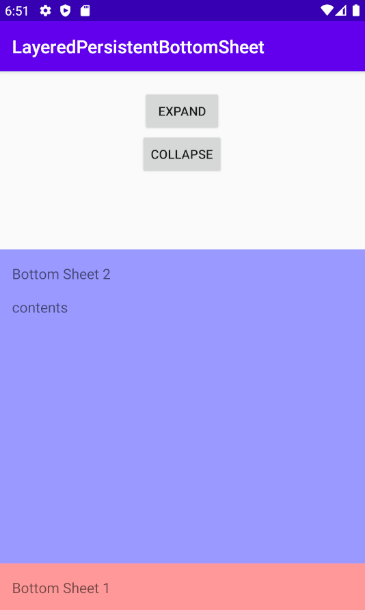
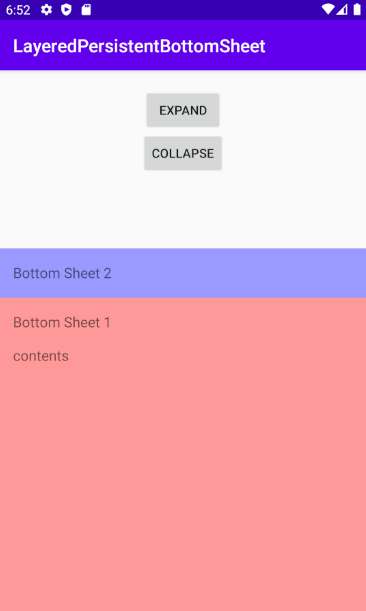
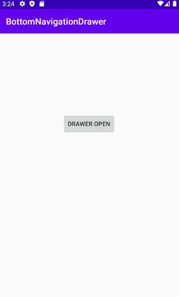
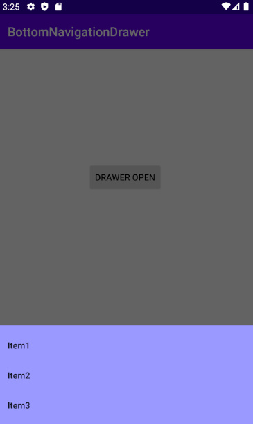

# Android View & MaterialDesign Practice

## 1. bottomnavigation_custom
Use : ViewPager , BottomNavigationView, Fragment 

## 2. Layered Persistent BottomSheet
Use : NestedScrollView, CoordinatorLayout, BottomSheetBehavior(Material)

   
   

## 3. Bottom Navigation Drawer
Use : BottomNavigationDrawerFragment(Material)

   
   

